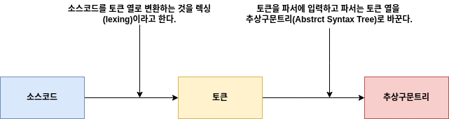
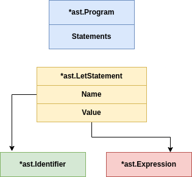
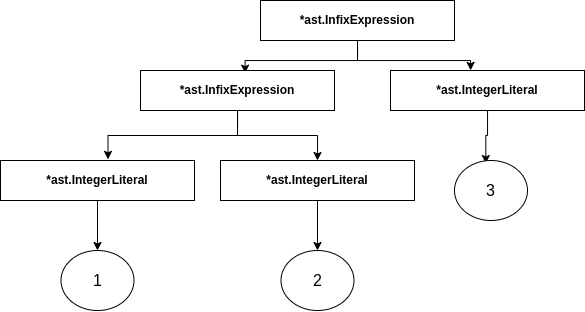
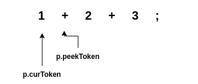

# Interpreter-In-Go

## 렉싱

- 소스코드 > 토큰 > 추상구문트리
- 소스코드를 토큰열로 바꾸는 작업을 렉싱이라고 한다. 또는 어휘분석(lexical analysis)라고 부른다.
- 토큰은 자체로 쉽게 분류할 수 있는 작은 자료구조다.
- 파서는 전달받은 토큰열을 추상구문트리(Abstract Syntax Tree)로 바꾼다.



## 토큰 정의하기

- 변수이름은 식별자로 부른다.
- 보일러플레이트란 매번 변경 없이 반복되는 코드를 뜻한다.

## 렉서

- 렉서는 소스코드를 입력받고 소스코드를 표현하는 토큰열을 결과로 출력한다.
- 렉서는 입력받은 코드를 훑어가면서 토큰을 인식할 때마다 결과를 출력한다.
- 버퍼도 필요없고 토큰 저장도 필요없다. 다음 토큰을 출력하는 NextToken메서드 하나면 충분하다.

## REPL(Read Eval Print Loop)

- 대다수의 인터프리터 언어는 이 REPL을 가지고 있다. (JavaScript, Python, Ruby, Lisp류의 언어 등)
- REPL은 콘솔 혹은 대화형 모드라고 부른다.
- REPL은 입력을 읽고(Read), 인터프리터에 보내 평가하고(Eval), 인터프리터의 결과물을 출력하고(Print) 이런 동작을 반복하기(Loop) 때문에 REPL(Read, Eval, Print, Loop)이라고 부른다.

## 파서(Parser)

위키피디아의 설명이지만 개념을 참고해보자

- 파서는 (주로 문자로 된) 입력 데이터를 받아 자료구조를 만들어 내는 소프트웨어 컴포넌트다. 자료구조 형태는 파스 트리(parse tree), 추상구문트리일 수 있고, 그렇지 않으면 다른 계층 구조일 수도 있다.
  파서는 자료구조를 만들면서 입력에 대응하는 구조화된 표현을 더하기도 구문이 올바른지 검사하기도 한다. (중략) 보통은 파서 앞에 어휘 분석기(lexical analyzer)를 따로 두기도 한다.

### 다음은 ast가 만들어지는 과정을 그림으로 나타낸 것이다.

  

- 파서는 입력을 표현하는 자료구조로 변환한다.
- 다음과 같은 자바스크립트 Json 파서가 있다. 개념수준에서는 프로그래밍 언어의 파서와 Json 파서는 개념이 같다.

```
> var input = '{"name": "Thorsten", "age":28 }'
> var output = JSON.parse(input)
> output
{name : 'Thorsten', age:28}
> output.name
'Thorsten'
>output.age
28
>
```

- 인터프리터와 컴파일러 관련 주제에서 소스코드를 내부적으로 표현할 때 쓰는 자료구조를 "구문트리(syntax tree)" 내지 추상구문트리(Abstract Syntax Tree, 이하 AST)라고 부른다.
- 파싱 프로세스를 구문 분석(syntactic analysis)라고도 부른다.
- 프로그래밍 언어를 파싱할 때 크게 두 가지 전략이 있다. 하향식(top-down)과 상향식(bottom-up)이다.
- 하향식의 예로는 재귀적 하향 파싱(recursive decent parsing), 얼리 파싱(Earley parsing), 예측적 파싱(predictive parsing)등은 모두 하향식 파싱을 변형한 것들이다.
- 여기서는 재귀적 하향 파서를 만들 것이다. 이 파서는 프랫 파서(Pratt parser)라고 불리기도 한다. 왜냐하면 최초로 만든 사람의 이름이 본 프랫(Vaughan Pratt)이다.
- 하향식 파서는 AST의 루트노드를 생성하는 것으로 시작해서 점차 아래쪽으로 파싱해 나간다.

## 전위 표현식은 단항 표현식(unary expression)이라고 부른다.

<prefix operator><expression>;

## 중위 표현식은 이항 표현식(binary expression)이라고 부른다.

<expression> <infix operator> <expression>

#### 프랫파싱은 어떻게 동작하는가

##### 다음은 1 + 2 + 3 ;을 파싱했을 때 나온 결과물이다.





#### 참고(책에서 나오는 여러 자료 및 글)

#### TDD(Test-Driven-Development)

- 테스트주도개발(2014) 인사이트
- (Red/Green/Refactor: TDD 만트라로 Red 단계에서는 항상 실패하는 테스트(test that doesn't work - failing test)를 먼저 작성한다. 심지어 처음에는 컴파일이 안될수도 있다.
  Green 단계에서는 최대한 빠르게 테스트가 동작하도록 만든다. Green에서는 모든 수단과 방법을 가리지 않고 통과하게 만든다. Refactor 단계에서는 테스트가 통과하는 한도내에서 모든 중복을 제거한다.)

#### 표현식 파싱

- 본 프랫(Vaughan Pratt) 그의 논문 <하향식 연산자 우선순위(Top Down Operator Precedence)>에서 다음과 같이 표현식 파싱 방법을 제안한다.
- ...은 쉽게 이해할 수 있을만큼 단순하며 구현과 사용이 아주 쉽고 이론적으로는 아닐지 몰라도 극도로 실용적이며 합당한 구문적 요구사항을 대다수 만족시키고도 남을 만큼 유연하다.
- 더글라스 크락포드(자바스크립트 핵심가이드, 자바스크립트는 왜 그 모양일까의 저자, JSON포맷을 대중화했음)의 글 (하향식 연산자 우선순위)에서 프랫의 생각을 자바스크립트로 어떻게 구현했는지 보여준다. 크락포트에 따르면 JsLint를 개발할 때 위 방법을 사용했다고 한다.
- 더글라스 크락포드의 블로그 글 참고 https://crockford.com/javascript/tdop/tdop.html (하향식 연산자 우선순위)
- JSLint : 더글라스 크락포드가 개발한 JavaScript 툴로 JavaScript 정적 코드 분석기

- <Game Programming Patterns>의 저자인 밥 나이스트롬(Bob Nystrom)의 글인 Pratt Parsers : Expression Parsing Made Easy의 글의 일독을 권함
- 밥 나이스트롬 (게임 프로그래밍 패턴)의 저자, 구글에서 Dart 언어의 개발자로 참여하고 있음

- 프랫파싱은 하향식 연산자 우선순위 파싱이라고도 불린다.
- 이 프랫파싱은 문맥무관문법(CFG: content-free grammars)와 배커스 나우어 형식(BNF: Backus-Naur-Form)에 기반한 파서를 대체할 목적으로 개발됐다.

#### 용어

- 전위연산자(prefix operator)는 피연산자 "앞에 붙는" 연산자다.
  예시 : --5
- 후위연산자(postfix operator)는 피연산자 "뒤에 붙는" 연산자다.
  예시 : foobar++
- 중위연산자(infix operator) 중위 연산자는 피연산자 사이에 놓이는 연산자다. 중위 연산자는 이항 표현식(binary expression)이다. 다시 말해 피연산자가 두 개라는 뜻이다.
  예시 : 5 \* 8
- 연산자 우선순위(operator precedence) or 연산 순서(order of operation)
  예시 : 5 + 5 \* 10
- 파싱함수 (프랫은 이런 파싱함수를 semantic code라고 불렀다.)
- 표현식 AST
  let x = 5
  x + 10;
- 테스트 커버리지(test coverage)
  테스트 품질(test quality)를 측정하기 위한 수단으로 테스트 코드가 소스코드를 얼마만큼 실행하고 있는지 보여주는 척도이다. 단순한 예로 설명하면 메서드가 두 개 있고 테스트 함수가 메서드를 하나만
  테스트하고 있으면 테스트 커버리지는 50%다.

첫 번째 행은 let 문이고 두 번째 행은 표현식문이다. 스크립트 언어들은 대체로 표현식문을 지원한다.
